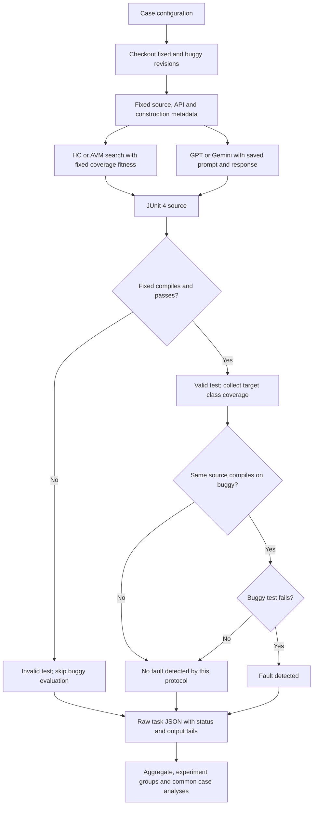

# รายงานฉบับสมบูรณ์: การเปรียบเทียบการสร้าง Java Unit Test ด้วยอัลกอริทึมและ AI-Assisting Tools

**โครงการ:** SQA Defects4J Benchmark — Hill Climbing, AVM, GPT และ Gemini  
**วันที่จัดทำรายงาน:** 1 ตุลาคม 2026  
**ช่วงเวลาของผลที่บันทึก:** 23–28 กันยายน 2026 ตาม `timestamp_utc` ใน raw JSON  
**ขอบเขต:** 854 เคส จาก 17 โปรเจกต์, 4 วิธี, 3,416 tasks

รายงานนี้จัดทำจากผลทดลองที่มีอยู่จริงใน workspace ใช้ [raw JSON](results/workers/) เป็นหลักฐานต้นทาง และตรวจผลสรุปกับ [summary_by_method.csv](results/summary/summary_by_method.csv) ไม่มีการรัน generator ใหม่หรือแก้ผลเดิมเพื่อจัดทำรายงาน

## บทคัดย่อ

งานนี้เปรียบเทียบการสร้าง Java unit test อัตโนมัติด้วย Hill Climbing, Alternating Variable Method (AVM), GPT และ Gemini บน Defects4J โดยใช้ fixed revision สำหรับสร้างเทสต์และ oracle แล้วประเมินเทสต์เดียวกันบน fixed และ buggy revisions วัด validity, fault detection, instruction/branch/line coverage ของ target class จำนวน JUnit tests และเวลา

จากผลรวม 854 เคสต่อวิธี GPT ตรวจบั๊กได้มากที่สุด 38 เคส (4.45%) ตามด้วย Hill Climbing 12, AVM 11 และ Gemini 8 เคส Gemini ใช้เวลาต่อ completed task เฉลี่ยน้อยที่สุด 7.45 วินาที HC/AVM มี validity ใน completed tasks สูงประมาณ 98% แต่ไม่รองรับ 503 เคสต่อวิธี เมื่อใช้ทุกเคสเป็นตัวหาร ทั้งคู่สร้างชุดเทสต์ valid ได้ 40.28% ขณะที่ GPT และ Gemini ได้ 65.69% และ 50.12% ตามลำดับ

ข้อมูลมีสอง experiment_id และข้อจำกัดจำนวนเทสต์ระหว่างวิธีไม่เท่ากัน ผลรวมจึงเป็นผลเชิงพรรณนาของเครื่องมือ/configuration ชุดนี้ ผลบน 231 เคสที่ทุกวิธีสร้างเทสต์ valid ยังพบว่า GPT มี coverage เฉลี่ยสูงที่สุดและตรวจบั๊กได้ 10 เคส เทียบกับ HC 8, AVM 7 และ Gemini 3 แต่ยังไม่เพียงพอที่จะสรุปความเหนือกว่าทั่วไปหรือเชิงสถิติ บทเรียนหลักคือ coverage และจำนวนเทสต์เพียงอย่างเดียวไม่รับประกันการตรวจบั๊ก ความถูกต้องของ oracle ความสามารถสร้าง object/setup และการควบคุม provenance มีผลต่อคุณภาพ benchmark อย่างมาก

## 1. วัตถุประสงค์และคำถามการทดลอง

1. เปรียบเทียบความสามารถของทั้งสองอัลกอริทึมและ AI-Assisting Tools ทั้งสองตัวในการสร้างเทสต์ที่ compile/ผ่านบน fixed revision และตรวจบั๊กบน buggy revision
2. วิเคราะห์ coverage, จำนวน tests และเวลาที่ใช้ พร้อมความแตกต่างของวิธีสร้าง input, setup และ oracle
3. สรุปผลการเรียนรู้ ปัญหาจากการทดลองและทดสอบ และข้อจำกัดในการตีความ
4. ส่ง source code, generated test code, ผลทดสอบ, diagram, prompt/configuration และขั้นตอนที่ผู้อ่านตรวจสอบหรือทำซ้ำได้

คำถามหลักคือแต่ละวิธีให้ชุดเทสต์ที่ใช้ได้บ่อยเพียงใด ตรวจพบกี่บั๊ก ครอบคลุมคลาสเป้าหมายมากเพียงใด และใช้ทรัพยากรด้านเวลาเท่าใด โดยพิจารณาขอบเขตที่แต่ละวิธีรองรับด้วย

## 2. วิธีที่นำมาเปรียบเทียบ

| วิธี | การเลือก input/setup | การสร้าง oracle | จุดแข็งของการออกแบบ | ข้อจำกัดของ implementation |
| --- | --- | --- | --- | --- |
| Hill Climbing | ค้นหารอบ candidate ปัจจุบัน เปลี่ยน input/setup และ random restarts ตาม seed | รัน candidate บน fixed revision แล้วแปลงผลเป็น assertions | ตรวจย้อนกลับ input, setup, fitness และพฤติกรรมได้ | primitive/String domain, bounded object construction, อาจติด plateau |
| AVM | สำรวจ setup ตามลำดับ ค้นหาทีละตัวแปร และ numeric pattern moves | ใช้พฤติกรรม fixed เช่นเดียวกับ HC | มีลำดับค้นหาเป็นระบบและใช้ evaluator/domain ร่วมกับ HC | bounds เดียวกับ HC; ตัวแปรที่สัมพันธ์กันและ coverage plateau อาจค้นยาก |
| GPT | ใช้ fixed source/API และ prompt เพื่อเลือก inputs และเขียน Java | โมเดลอนุมานค่าคาดหวัง/สถานะ/exception จาก context | สร้าง assertions และกรณีขอบเขตที่หลากหลายได้ | อาจอ้าง API หรือพฤติกรรมผิด; ขึ้นกับ prompt/context/gateway |
| Gemini | ใช้ prompt แบบวิเคราะห์ branch เลือก input สร้าง oracle และตรวจ compile | โมเดลสร้าง assertions จาก fixed context | response เร็วในข้อมูลชุดนี้ | ความถูกต้องของ API/setup/assertion และการทำตามจำนวน tests ไม่สม่ำเสมอ |

HC/AVM ใช้ fitness `branch_ratio + 0.001 × instruction_ratio` ของ target class โดยใช้ branch เป็นเป้าหมายหลักและ instruction เป็นตัวแยกคะแนน ทั้งสองเก็บ candidate archive ได้ 3 candidates ต่อ target method และเลือกพฤติกรรม fixed ที่แตกต่างกันก่อน

AI ใช้ gateway KKU ที่ endpoint ใน [settings.json](config/settings.json) ชื่อโมเดลที่บันทึกคือ `gpt-5.6-terra` และ `gemini-3.5-flash-lite`, temperature 0, prompt `v1` ชื่อนี้เป็น model string ของ gateway ไม่ได้มีหลักฐาน build ของโมเดลภายใน ผลเป็นการเปรียบเทียบ **แต่ละเครื่องมือพร้อม prompt/configuration** ไม่ใช่การควบคุมให้ต่างเพียงโมเดลอย่างเดียว

Source ที่เกี่ยวข้อง: [hill_climbing.py](algorithms/hill_climbing.py), [avm.py](algorithms/avm.py), [candidate_archive.py](algorithms/candidate_archive.py), [gpt.py](ai/gpt.py), [gemini.py](ai/gemini.py), [construction.py](construction.py), [evaluate.py](evaluate.py)

## 3. การออกแบบและขั้นตอนการทดลอง

### 3.1 Dataset และการแบ่ง worker

ใช้รายการ enabled cases ใน [cases.csv](config/cases.csv) จำนวน 854 เคส เรียงตาม `(project, bug_id)` แล้วแบ่งช่วงไม่ซ้ำกัน แต่ละ worker รันทั้งสี่วิธีสำหรับทุกเคสของตน

| Worker | ช่วงเคส | จำนวนเคส | จำนวนผล | experiment_id |
| --- | --- | ---: | ---: | --- |
| `member1_final` | 1–285 | 285 | 1,140 | `9f661b38cc1eee98` |
| `member2` | 286–570 | 285 | 1,140 | `9f661b38cc1eee98` |
| `worker3` | 571–854 | 284 | 1,136 | `1b010d74235e8785` |

ทุกผลบันทึก Git commit `d7f55a4e608de5ae552bdccdb52acf50b2d62b14` แต่ `experiment_id` ต่างกันระหว่าง worker3 กับอีกสองเครื่อง workspace ปัจจุบันคำนวณได้ `9f661b38cc1eee98` และ archive ของ worker3 ไม่มี source/settings snapshot ที่อธิบายอีก ID จึงยังระบุไม่ได้ว่าความต่างเกิดจากไฟล์ใด หลักฐานอยู่ใน [audit.json](docs/report_data/audit.json)

### 3.2 เงื่อนไข generation และ fairness

ใช้ fixed revision ในการค้นหาและสร้าง oracle ไม่ให้ generator เห็น buggy source, patch, diff, issue หรือ triggering test อย่างไรก็ตามผล 3,415 tasks บันทึก `target_selection_source = defects4j_classes.modified` อีกหนึ่ง task ล้มเหลวใน preparation และไม่มี field นี้ จึงเป็น benchmark ที่ทราบคลาสที่ถูกแก้บั๊กระดับคลาส (target-aware)

HC/AVM รองรับเฉพาะ eligible public methods ที่รับ primitive/String ส่วน object receiver และ setup ถูกสร้างผ่าน public API ภายใต้ depth/type/time caps ค่าของ constructor เป็นค่าโครงสร้างคงที่ ไม่มีการค้นหา arbitrary Java object graph

ทั้งสี่วิธีเลือก target ไม่เกิน 5 methods จาก metadata เดียวกัน แต่ HC/AVM สร้างได้สูงสุด 15 `@Test` ขณะที่ AI prompt ขอหนึ่ง `@Test` ต่อ method และ AI ยังสร้าง response เมื่อ target list ว่างได้ จำนวน assertions หรือ inputs ภายในหนึ่ง `@Test` ไม่ได้จำกัดเท่ากัน

### 3.3 Configuration และ environment

| รายการสำคัญ | ค่าในชุด source/config ที่ส่งมอบ |
| --- | --- |
| HC/AVM repetition | seed 101 หนึ่งครั้ง |
| GPT/Gemini repetition | หนึ่ง run ต่อวิธีต่อเคส |
| Target/search | 5 target methods; 20 evaluations ต่อ method; 3 candidates ต่อ method; HC restarts 2 |
| Algorithm budget | 180 s หลัง preparation; search 110 s; final reserve 60 s |
| Candidate/test timeout | 30 s / 45 s |
| Construction | depth 3, types 24, timeout 15 s และ subtype scan แบบจำกัด |
| Stateful setup | actions 4, parameters 2, steps 2, sequences 8 |
| AI limits | source 14,000 characters, output 4,096 tokens, API timeout 120 s, retries 2 |
| Container definition | Ubuntu 20.04, Java 11, timezone America/Los_Angeles, locale C.UTF-8 |
| Coverage tool | JaCoCo 0.8.13 ตาม URL ที่กำหนดใน evaluator |

configuration ครบทุกค่าดู [EXPERIMENT_PROTOCOL.md](EXPERIMENT_PROTOCOL.md) และ [settings.json](config/settings.json) ไม่ได้อ้างว่าค่าทุก field ของ worker3 ตรงกับ workspace นี้ environment ของเครื่องจัดทำรายงานบันทึกแยกไว้ใน [environment_observed.json](docs/report_data/environment_observed.json) แต่ไม่มี version/hardware snapshot ย้อนหลังครบทั้งสาม worker

### 3.4 Diagram ของการประเมิน



`valid_test` เป็นคุณสมบัติระดับชุดเทสต์ การตรวจบั๊กนับเมื่อ fixed ผ่าน, buggy compile ผ่าน และ buggy process รันไม่ผ่าน `completed` ไม่ได้แปลว่าเทสต์ valid เสมอ และงาน valid ที่เก็บ coverage ไม่ได้จะเป็น `error`

### 3.5 ตัวชี้วัดและวิธีวิเคราะห์

- **Validity rate:** valid completed tasks / completed tasks
- **Valid yield:** valid completed tasks / ทั้ง 854 configured tasks ต่อวิธี
- **Fault detection:** unique `(project, bug_id)` ที่มี completed detecting run / 854
- **Coverage:** ค่าเฉลี่ย coverage ratio ของ valid completed tasks ที่มีข้อมูล เฉพาะ target class บน fixed revision
- **เวลา:** ค่าเฉลี่ย/มัธยฐานของ completed tasks ที่มี field ไม่รวม checkout/compile preparation; generation ของ search รวม candidate evaluation และ JaCoCo ขณะค้นหา
- **Efficiency:** coverage ratio หรือเวลาหารจำนวน `@Test` ราย task แล้วเฉลี่ย เป็นตัวชี้วัดเสริม ไม่ใช่ coverage เพิ่มเติมต่อ test แบบ marginal

ค่าที่ไม่มีข้อมูลไม่ถูกตีความเป็น coverage/time 0 การวิเคราะห์เพิ่มใช้เคสที่ทุกวิธี completed จำนวน 349 เคส และเคสที่ทุกวิธี completed และ valid จำนวน 231 เคส พร้อมผลแยก experiment_id เพื่อเปิดเผย selection และ provenance ของข้อมูล

## 4. ผลการทดลอง

### 4.1 ความครบของข้อมูลและความสามารถสร้างเทสต์

พบผลครบ 3,416 tasks ไม่มี task ขาด/เกิน/ซ้ำตาม inventory ปัจจุบัน รวม `completed` 2,401, `unsupported` 1,006 และ `error` 9 tasks ไม่มี `paused_quota` ค้างใน final data

| วิธี | Tasks | Completed | Unsupported | Error | Valid suites | Valid / completed | Valid / 854 |
| --- | ---: | ---: | ---: | ---: | ---: | ---: | ---: |
| Hill Climbing | 854 | 349 | 503 | 2 | 344 | 98.57% | 40.28% |
| AVM | 854 | 350 | 503 | 1 | 344 | 98.29% | 40.28% |
| GPT | 854 | 849 | 0 | 5 | 561 | 66.08% | 65.69% |
| Gemini | 854 | 853 | 0 | 1 | 428 | 50.18% | 50.12% |

อัตรา 98% ของ HC/AVM สะท้อนความถูกต้องเมื่อ implementation สร้าง candidate และประเมินจบแล้ว แต่มีเคส unsupported 58.90% ต่อวิธี GPT มี valid yield มากที่สุดในข้อมูลนี้ แม้อัตรา valid เฉพาะ completed ต่ำกว่า search ข้อมูล: [summary_by_method.csv](results/summary/summary_by_method.csv), [failure_breakdown.csv](docs/report_data/failure_breakdown.csv)

### 4.2 การตรวจบั๊กและ coverage ของผลรวม

| วิธี | บั๊กตรวจพบ | Detection / 854 | Instruction เฉลี่ย | Branch เฉลี่ย | Line เฉลี่ย | จำนวน valid suites สำหรับ coverage |
| --- | ---: | ---: | ---: | ---: | ---: | ---: |
| Hill Climbing | 12 | 1.41% | 21.85% | 11.03% | 23.25% | 344 |
| AVM | 11 | 1.29% | 22.34% | 11.45% | 23.74% | 344 |
| GPT | 38 | 4.45% | 27.39% | 16.02% | 27.95% | 561 |
| Gemini | 8 | 0.94% | 26.55% | 15.17% | 27.55% | 428 |

GPT มีจำนวน detecting bugs และค่าเฉลี่ย coverage สูงที่สุดในผลรวมนี้ แต่ coverage แต่ละวิธีเฉลี่ยจากคนละกลุ่ม valid cases จึงยังเทียบคุณภาพบนเคสเดียวกันโดยตรงไม่ได้ AVM มี coverage เฉลี่ยสูงกว่า HC เล็กน้อย แต่ HC ตรวจบั๊กได้มากกว่า 1 เคส แสดงว่าการเพิ่ม coverage ไม่จำเป็นต้องเพิ่ม detection

รวมทั้งสี่วิธีตรวจบั๊กได้ **51 เคสที่แตกต่างกัน** จาก 854 (5.97%) HC และ AVM พบตรงกัน 11 เคส โดย HC พบ Time-9 เพิ่มอีกหนึ่งเคส GPT พบ 32 เคสที่อีกสามวิธีไม่พบ และ Gemini พบเฉพาะตน 5 เคส ได้แก่ Gson-4, JacksonDatabind-105, Math-31, Math-54 และ Math-95 จึงมีประโยชน์จากความหลากหลายของวิธี แต่ไม่ได้ทดลองระบบผสมที่สร้างและคัดเลือกเทสต์ร่วมกันจริง หลักฐานทุกเคสอยู่ใน [detected_bugs.csv](docs/report_data/detected_bugs.csv)

### 4.3 เวลา จำนวน tests และ efficiency

| วิธี | Generated `@Test` ทั้งหมด | `@Test` ใน valid suites | Tests เฉลี่ย / completed task | Generation เฉลี่ย (s) | Evaluation เฉลี่ย (s) | Total เฉลี่ย (s) | Total มัธยฐาน (s) |
| --- | ---: | ---: | ---: | ---: | ---: | ---: | ---: |
| Hill Climbing | 3,160 | 3,070 | 9.01 | 50.12 | 7.65 | 57.77 | 41.00 |
| AVM | 3,275 | 3,171 | 9.31 | 46.41 | 7.68 | 54.08 | 35.87 |
| GPT | 2,234 | 1,721 | 2.62 | 21.16 | 6.50 | 27.66 | 24.45 |
| Gemini | 2,926 | 1,579 | 3.43 | 2.36 | 5.09 | 7.45 | 4.87 |

Generated counts รวม tasks invalid/error ที่นับ tests ได้ แต่เวลาและ tests เฉลี่ยใช้ completed tasks ตาม `analyze.py` ไม่ได้ประเมินเวลาของ unsupported ทั้งหมด และไม่รวม setup ของ Defects4J

| วิธี | Instruction ต่อ `@Test` | Branch ต่อ `@Test` | Line ต่อ `@Test` | Total time ต่อ `@Test` (s) |
| --- | ---: | ---: | ---: | ---: |
| Hill Climbing | 4.32 จุดเปอร์เซ็นต์ | 1.47 จุดเปอร์เซ็นต์ | 4.51 จุดเปอร์เซ็นต์ | 9.11 |
| AVM | 4.27 จุดเปอร์เซ็นต์ | 1.46 จุดเปอร์เซ็นต์ | 4.46 จุดเปอร์เซ็นต์ | 7.81 |
| GPT | 13.95 จุดเปอร์เซ็นต์ | 7.44 จุดเปอร์เซ็นต์ | 14.14 จุดเปอร์เซ็นต์ | 15.15 |
| Gemini | 11.33 จุดเปอร์เซ็นต์ | 5.69 จุดเปอร์เซ็นต์ | 11.57 จุดเปอร์เซ็นต์ | 3.17 |

ตัวชี้วัดต่อ test เป็นค่าเฉลี่ยของ `metric / test_case_count` ราย task ไม่ใช่ coverage ที่เพิ่มจากแต่ละ test GPT อาจมีหลาย assertions และเรียก method หลาย input ภายใน `@Test` เดียว เช่น Chart-24 จึงไม่ควรใช้ค่านี้ตัดสินว่าหนึ่ง test ของ AI มีประสิทธิภาพสูงกว่าหนึ่ง test ของ search โดยทั่วไป Gemini มีเวลาเฉลี่ยและมัธยฐานต่ำที่สุดในชุดนี้ ส่วน AVM ใช้เวลาน้อยกว่า HC เล็กน้อย ข้อมูล: [summary_by_method.csv](results/summary/summary_by_method.csv), [failure_breakdown.csv](docs/report_data/failure_breakdown.csv)

### 4.4 ผลบนเคสเดียวกัน

บน **349 เคสที่ทุกวิธี completed** HC/AVM/GPT/Gemini มี valid suites 344 / 344 / 316 / 254 และตรวจบั๊กได้ 12 / 11 / 20 / 4 เคส การเปรียบเทียบนี้ใช้ inventory เดียวกัน แต่ค่าเฉลี่ย coverage ยังมีตัวอย่าง valid คนละจำนวน ดู [summary_common_completed.csv](docs/report_data/summary_common_completed.csv)

บน **231 เคสที่ทุกวิธี completed และ valid** ค่าเฉลี่ยต่อไปนี้ใช้เคสชุดเดียวกันทั้งหมด:

| วิธี | บั๊กตรวจพบ / 231 | Instruction | Branch | Line | Total เฉลี่ย (s) |
| --- | ---: | ---: | ---: | ---: | ---: |
| Hill Climbing | 8 (3.46%) | 21.12% | 9.93% | 22.55% | 53.82 |
| AVM | 7 (3.03%) | 21.46% | 10.25% | 22.81% | 50.07 |
| GPT | 10 (4.33%) | 25.11% | 14.26% | 25.94% | 26.82 |
| Gemini | 3 (1.30%) | 23.53% | 12.36% | 24.22% | 9.75 |

GPT ยังมี coverage เฉลี่ยและ detection มากที่สุด แต่ detection ของ GPT กับ HC ต่างเพียง 2 เคสบน subset นี้ ผลต่าง 38 กับ 12 ในตารางรวมจึงมีส่วนจากความสามารถสร้างเทสต์ valid บนเคสที่ search ไม่รองรับด้วย ชุด common valid เลือกเฉพาะเคสที่ทุกวิธีทำได้ จึงไม่ได้แทนทั้งหมด 854 เคส และยังมีสอง experiment_id ไม่มีการทดสอบนัยสำคัญทางสถิติ รายชื่อ subset: [cases_common_valid.csv](docs/report_data/cases_common_valid.csv), ผล: [summary_common_valid.csv](docs/report_data/summary_common_valid.csv)

### 4.5 ผลแยก experiment_id

| experiment_id | เคสต่อวิธี | วิธี | Completed | Valid | บั๊กตรวจพบ | Total เฉลี่ย (s) |
| --- | ---: | --- | ---: | ---: | ---: | ---: |
| `9f661b38cc1eee98` | 570 | Hill Climbing | 207 | 202 | 9 | 27.94 |
| `9f661b38cc1eee98` | 570 | AVM | 207 | 202 | 9 | 24.23 |
| `9f661b38cc1eee98` | 570 | GPT | 567 | 356 | 17 | 22.97 |
| `9f661b38cc1eee98` | 570 | Gemini | 569 | 255 | 4 | 4.24 |
| `1b010d74235e8785` | 284 | Hill Climbing | 142 | 142 | 3 | 101.25 |
| `1b010d74235e8785` | 284 | AVM | 143 | 142 | 2 | 97.30 |
| `1b010d74235e8785` | 284 | GPT | 282 | 205 | 21 | 37.08 |
| `1b010d74235e8785` | 284 | Gemini | 284 | 173 | 4 | 13.88 |

GPT ตรวจบั๊กได้มากที่สุดในทั้งสองกลุ่ม และ Gemini ใช้เวลาน้อยที่สุดในทั้งสองกลุ่ม แต่กลุ่ม 284 เคสใช้เวลามากกว่าอย่างชัดเจน กลุ่มนี้มีคนละ project mix, worker และ experiment definition จึงแยกสาเหตุจากตารางนี้ไม่ได้ ผล coverage และ efficiency แยก ID อยู่ใน [summary_by_experiment.csv](docs/report_data/summary_by_experiment.csv) และผล common subsets แยก ID อยู่ใน [docs/report_data/](docs/report_data/)

### 4.6 การตรวจบั๊กแยกโปรเจกต์

| Project | เคส | HC | AVM | GPT | Gemini |
| --- | ---: | ---: | ---: | ---: | ---: |
| Chart | 26 | 2 | 2 | 1 | 0 |
| Cli | 39 | 1 | 1 | 3 | 0 |
| Closure | 174 | 0 | 0 | 2 | 0 |
| Codec | 18 | 1 | 1 | 0 | 0 |
| Collections | 28 | 1 | 1 | 0 | 1 |
| Compress | 47 | 2 | 2 | 5 | 0 |
| Csv | 16 | 1 | 1 | 1 | 0 |
| Gson | 18 | 0 | 0 | 0 | 1 |
| JacksonCore | 26 | 0 | 0 | 1 | 0 |
| JacksonDatabind | 110 | 1 | 1 | 2 | 2 |
| JacksonXml | 6 | 0 | 0 | 0 | 0 |
| Jsoup | 93 | 1 | 1 | 3 | 0 |
| JxPath | 22 | 0 | 0 | 1 | 1 |
| Lang | 61 | 1 | 1 | 4 | 0 |
| Math | 106 | 0 | 0 | 8 | 3 |
| Mockito | 38 | 0 | 0 | 5 | 0 |
| Time | 26 | 1 | 0 | 2 | 0 |
| **รวม** | **854** | **12** | **11** | **38** | **8** |

ผลไม่ได้เรียงเหมือนกันทุกโปรเจกต์: search ตรวจ Chart ได้มากกว่า GPT ส่วน GPT พบหลายเคสใน Math และ Mockito และ Gemini มี detecting cases ที่วิธีอื่นไม่พบ ใน Closure ทั้ง HC และ AVM completed เพียง 12 จาก 174 เคส ส่วน GPT/Gemini valid 44/19 เคส แสดงความยากของ source/API/setup ใน implementation นี้ มากกว่าการสรุปจาก coverage เฉลี่ยอย่างเดียว ดูรายละเอียด [summary_by_project.csv](results/summary/summary_by_project.csv)

## 5. ตัวอย่างหลักฐานจาก generated tests

### 5.1 Chart-24: วิธีสร้าง oracle ต่างกัน

Hill Climbing สร้าง 6 tests บน `GrayPaintScale` โดยตรวจ lower/upper bounds และ `assertNotNull` จาก `getPaint(0.0)`, `getPaint(-1.0)`, `getPaint(100.0)` รวมถึง clone ผล fixed ผ่าน 6 tests และ buggy ล้มเหลว 2 tests ส่วน GPT สร้าง 4 tests โดยตรวจค่าขอบเขต สีที่คาดหวังหลาย input และ clone ใน `@Test` เดียวกัน ผล fixed ผ่าน 4 tests และ buggy ล้มเหลว 1 test

ตัวอย่างนี้แสดงว่า input นอกขอบเขตช่วยเปิดเผย fault และจำนวน `@Test` ไม่เท่ากับจำนวน input/assertion หรือความแรงของ oracle เพียง `assertNotNull` ก็ตรวจเจอ fault ได้หากการเรียก method ล้มเหลว ขณะที่ exact assertions สังเกตพฤติกรรมได้ละเอียดกว่า แต่ไม่รับประกัน detecting bugs มากกว่าในทุกเคส

หลักฐาน: [HC test](generated_tests/member1_final/Chart/24/hill_climbing/seed_101/Generated_hill_climbing_Chart_24_seed_101.java), [HC result](results/workers/member1_final/Chart/24/hill_climbing/seed_101.json), [GPT test](generated_tests/member1_final/Chart/24/gpt/run_1/GrayPaintScaleTest.java), [GPT result](results/workers/member1_final/Chart/24/gpt/run_1.json), [GPT prompt](generated_tests/member1_final/Chart/24/gpt/run_1/prompt.txt)

### 5.2 Collections-2: Gemini ตรวจพบผ่าน state observation

Gemini สร้าง 5 tests สำหรับ `ExtendedProperties` รวมการเรียก `setInclude("customInclude")`, ตรวจค่า public query แล้วเรียก `setInclude("")` และตรวจ `assertNull` ผล fixed ผ่าน 5 tests แต่ buggy ล้มเหลว 1 test เป็นตัวอย่างของการสังเกต state transition ผ่าน API โดยไม่ต้องเข้าถึง private fields

หลักฐาน: [Gemini test](generated_tests/member1_final/Collections/2/gemini/run_1/ExtendedPropertiesTest.java), [result](results/workers/member1_final/Collections/2/gemini/run_1.json), [prompt](generated_tests/member1_final/Collections/2/gemini/run_1/prompt.txt), [response](generated_tests/member1_final/Collections/2/gemini/run_1/response.txt)

### 5.3 Math-104: GPT ตรวจพฤติกรรมตัวเลขและ exception

GPT ใช้ known numeric values, invalid arguments, precision และ iteration limit ของ `Gamma` สร้าง 5 tests ผล fixed ผ่าน 5 tests และ buggy ล้มเหลว 1 test เป็นหนึ่งใน detecting cases ของ GPT ที่อีกสามวิธีไม่พบ การกล่าวถึงสาเหตุที่ GPT ตรวจพบเป็นการอ่าน generated test ไม่ใช่การทดลองแยกว่าปัจจัยใดทำให้ต่างกัน

หลักฐาน: [test](generated_tests/worker3/Math/104/gpt/run_1/GammaTest.java), [result](results/workers/worker3/Math/104/gpt/run_1.json), [prompt](generated_tests/worker3/Math/104/gpt/run_1/prompt.txt) Path ใน JSON เดิมใช้ Windows backslashes แต่ไฟล์จริงเปิดได้หลัง normalize

## 6. ปัญหาที่พบและผลกระทบ

### 6.1 Search domain และ object construction จำกัด

HC และ AVM มี unsupported เท่ากันวิธีละ 503 tasks จำแนกได้:

| สาเหตุ | HC | AVM | ความหมาย |
| --- | ---: | ---: | --- |
| Construction planner สร้าง concrete receiver ไม่ได้ภายใน public-API limits | 380 | 380 | ไม่สามารถเริ่มค้นหาพฤติกรรมของ receiver ได้ |
| ไม่มี public method ที่รับ primitive/String ตามที่รองรับ | 94 | 94 | target input อยู่พ้น search domain |
| ไม่พบ valid candidate ใน receiver/setup/target ที่เลือก | 29 | 29 | ขอบเขตหรือ search budget ไม่ทำให้ได้ candidate ใช้ได้ |

จึงไม่ควรสรุปว่าอัลกอริทึม Hill Climbing/AVM โดยหลักการทำงานไม่ได้กับ 503 เคส แต่เป็นข้อจำกัดของ generator และ budget ที่ใช้ ตัวอย่าง diagnostics มี `class_not_public` และ bounded graph ที่แก้ไม่ได้ ดู [unsupported_reasons.csv](docs/report_data/unsupported_reasons.csv) พบ search budget exhausted ใน HC 103 tasks และ AVM 81 tasks จาก field ที่บันทึก ซึ่งอาจยังได้ valid suite มาก่อนหมดเวลา

### 6.2 AI compile และ assertion/setup ไม่ผ่าน

| ผลบน fixed revision ของ completed tasks | HC | AVM | GPT | Gemini |
| --- | ---: | ---: | ---: | ---: |
| Compile ไม่ผ่าน | 0 | 0 | 91 | 343 |
| Compile ผ่าน แต่ tests ไม่ผ่าน | 5 | 6 | 197 | 82 |

GPT มี invalid completed tasks 288 และ Gemini 425 การมี Java response ไม่รับประกัน compile ได้ และการ compile ผ่านไม่รับประกัน assertions/setup ถูกต้อง output tails ใน JSON ใช้ตรวจเหตุของแต่ละเคสได้ แต่รายงานไม่ได้จำแนกทุก failure เป็น hallucination หรือ oracle ผิด เพราะ runtime/environment ก็อาจทำให้เทสต์ล้มเหลว ดู [failure_breakdown.csv](docs/report_data/failure_breakdown.csv)

### 6.3 Error ที่ยังคงอยู่ในชุดส่งงาน

| ประเภท error | งาน | หลักฐานเคส |
| --- | ---: | --- |
| Final JaCoCo coverage เก็บไม่สำเร็จ | 4 | GPT/Cli-16, GPT/Cli-21, GPT/Compress-42, Gemini/Compress-42 |
| Evaluation พบ `NoneType ... splitlines` | 3 | HC/Lang-11, HC/Lang-12, AVM/Lang-12 |
| Defects4J preparation/export timeout | 1 | GPT/Time-26 |
| Gateway DNS/network failure | 1 | GPT/Time-7 |

สี่ coverage-error tasks มี `valid_test = true` แต่ไม่เข้า main summary เพราะ status เป็น error โดยเฉพาะ GPT/Cli-21 มี `fault_detected = true` ด้วย ดังนั้น primary result คือ GPT 38 completed detecting bugs ไม่ใช่การนับ true flag ทุก JSON รวมงานนี้เข้าโดยไม่สนใจสถานะจะได้ 39 แต่ต้องระบุว่า coverage ไม่สมบูรณ์ หลักฐาน: [error_tasks.csv](docs/report_data/error_tasks.csv)

### 6.4 จำนวนเทสต์และ target policy ไม่ถูกบังคับเท่ากัน

GPT/Gemini มี tasks ที่ `test_case_count > target_method_count` จำนวน 141/277 และ Gemini มี 39 tasks ที่เกิน 5 tests ใน metadata ของทั้งสอง AI มี 258 tasks ต่อวิธีที่ `target_method_count = 0` จึงต้องระวังการใช้ตัวเลขเกินเพดานนี้เป็นหลักฐานว่าทุกงานละเมิดจำนวน methods โดยตรง บางงานเกิดจากไม่มี eligible methods แต่ยังส่ง prompt ให้ AI ไม่มี evaluator gate บังคับให้ response เรียกเฉพาะ methods ที่เลือก และไม่ได้ตรวจเพดาน `@Test`

การจำกัด tests คนละแบบ รวมทั้งหลาย assertions/inputs ในหนึ่ง test ทำให้ coverage-per-test เป็นเพียง indicator ถ้าต้องการเปรียบเทียบแบบควบคุมเข้มงวด ควรบังคับ target list ที่ไม่ว่าง จำนวน tests หรือจำนวน calls และ budget เดียวกันในรอบใหม่ โดยไม่ปรับค่าของรอบนี้ย้อนหลัง

### 6.5 Provenance และไฟล์ที่ไม่ได้เก็บครบทุกประเภท

ผลมีสอง experiment_id แม้ Git commit เหมือนกัน และ `analyze.py` ใน workspace ถูกแก้ไว้ก่อนจัดทำรายงานให้เตือนแล้วรวม ID ได้ ความต่างนี้อยู่ใน [analysis_workspace.patch](docs/report_data/analysis_workspace.patch) รายงานจึงส่งผลแยก ID ด้วย

generated artifacts ที่ JSON อ้างถึงมีครบ ก่อนจัดเตรียม GitHub พบ Java อีก 3 ไฟล์ที่ task JSON ปัจจุบันไม่ได้อ้างถึง จึงย้ายไปสำรองนอกโปรเจกต์และไม่รวมคะแนน/ชุดส่งงานปัจจุบัน มี metadata เพียง 288 เคสและไม่มี console `.log` จาก worker เดิม JUnit/compile output ที่มีเป็น `output_tail` ใน JSON ไม่ใช่ full logs และ final JaCoCo CSV/.exec ถูก evaluator ล้างหลังประเมิน `results/tmp/` ที่เหลือมีเพียงโฟลเดอร์ว่างและถูกล้างเมื่อจัดเตรียม GitHub

## 7. ผลการเรียนรู้และการอภิปราย

**ต้องแยกความถูกต้องเมื่อสร้างได้ออกจากความสามารถรองรับทั้ง dataset** HC/AVM มี validity เกือบ 99% ใน completed tasks เพราะ oracle มาจากการรัน fixed แต่ valid yield เพียง 40.28% เนื่องจาก construction/domain restrictions การรายงานเปอร์เซ็นต์เดียวอาจทำให้เข้าใจผิด

**Coverage สูงไม่ได้แปลว่าตรวจบั๊กมาก** AVM มี coverage รวมสูงกว่า HC เล็กน้อยแต่ตรวจบั๊กน้อยกว่า และ Gemini มี coverage ของ valid cases ใกล้ GPT แต่ detection น้อยกว่าอย่างชัดเจน การไปถึง branch ต้องมี input/state ที่กระตุ้น fault และ oracle ที่สังเกตความต่างได้ด้วย

**การสร้าง object และ state เป็นส่วนสำคัญของ test generation** เคส unsupported ส่วนใหญ่เกิดก่อน input search เริ่มทำงาน การเพิ่มความสามารถ receiver/setup อาจขยายเคสที่ทดสอบได้ แต่ผลนี้ยังไม่ได้ทดลองว่าการเพิ่ม planner จะเพิ่ม detection เท่าใด

**AI ลดเวลาเขียนเทสต์ได้ แต่ต้องผ่าน compile และ fixed verification** Gemini ให้ response เร็วมากในชุดนี้ แต่มี compile failures 343 งาน ขณะที่ GPT มี compile failures 91 และ fixed-test failures 197 งาน การประเมินอัตโนมัติจึงเป็นส่วนจำเป็นก่อนใช้ generated tests

**จำนวน `@Test` ไม่ใช่ปริมาณการทดสอบทั้งหมด** GPT/Chart-24 ตรวจหลาย inputs และ assertions ในหนึ่ง test ส่วน search แยก candidates เป็นหลาย tests การวิเคราะห์ efficiency ควรดูจำนวน calls/assertions และคุณภาพ oracle เพิ่มเติมในรอบต่อไป

**วิธีต่างกันพบ fault คนละส่วน** Gemini มี 5 detecting bugs ที่วิธีอื่นไม่พบ และ search ยังพบหลายเคสที่ AI ไม่พบทั้งหมด ผล union 51 แสดงความครอบคลุมจากความหลากหลาย แต่การออกแบบระบบผสมและการวัดต้นทุนเพิ่มเติมยังเป็นงานในอนาคต

**Source commit อย่างเดียวไม่พอสำหรับ reproduction** ต้องเก็บ working source, config, prompt, experiment hash, environment, actual AI response และ generated code สอง worker groups ในงานนี้มี ID ต่างกันทั้งที่ commit เดียวกัน และ output ที่ `.gitignore` ละเว้นต้องส่งแยกอย่างชัดเจน

## 8. ข้อจำกัดต่อข้อสรุป

1. มีสอง experiment definitions โดยไม่มี snapshot ของกลุ่ม worker3 จึงทำซ้ำ generator ของกลุ่มนี้ให้ตรงทุกค่าไม่ได้จากหลักฐานที่มี
2. ใช้ seed/repetition เดียว ไม่มีการวัด variance หรือ significance จากการทำซ้ำ และไม่มี model snapshot ของ gateway
3. target-aware class selection, fixed source ที่ถูกตัดตาม cap และ bug ID ใน prompt ทำให้ไม่ใช่ benchmark ที่ไม่ทราบตำแหน่งบั๊กหรือปลอดจากโอกาส model memorization อย่างสมบูรณ์
4. search domain, construction, test count, budget และ prompt ต่างกัน ผลเป็นของ implementations ชุดนี้
5. coverage/time ใน aggregate เฉลี่ยจากกลุ่มที่ผ่านต่างกัน common-valid subset ช่วยควบคุมเคส แต่มี selection bias และไม่ได้ลบข้อจำกัดด้าน environment/configuration
6. ไม่มี hardware/version snapshot ทุก worker และไม่มีข้อมูลราคา จึงไม่สรุปความเร็วบนเครื่องเดียวกันหรือความคุ้มค่าทางราคา
7. detector ใช้ buggy process failure เป็นเกณฑ์ ต้องอ่าน JUnit failure เพิ่มเมื่อต้องการยืนยันชนิด fault ในระดับรายเคส
8. partial metadata, output tails และ coverage ratios ที่เก็บไว้เพียงพอทำซ้ำการสรุป แต่ไม่ได้ทดแทน full execution/coverage logs ที่ไม่ได้บันทึก

## 9. ข้อสรุปและแนวทางพัฒนา

ภายใต้ implementation และข้อมูลที่ส่งมอบ GPT ให้ valid yield และจำนวน detecting bugs สูงที่สุด Gemini ใช้เวลาต่องานน้อยที่สุด HC/AVM ให้ validity สูงเมื่อรองรับเคส โดย AVM มี coverage สูงกว่า HC เล็กน้อยและใช้เวลาน้อยกว่า แต่ HC ตรวจบั๊กได้เพิ่ม 1 เคส ทุกวิธียังมี detection ต่ำเมื่อเทียบทั้ง 854 เคส จึงควรดู oracle, setup และ target selection ควบคู่กับ coverage

รอบต่อไปควร frozen experiment เดียวพร้อม environment snapshot, ใช้หลาย seeds/repetitions, กำหนด budget/test policy ร่วม, ตรวจ AI target/API/compile แบบมีขั้นตอน repair ที่วัดต้นทุนแยก และบันทึก full JUnit/coverage logs การขยาย construction planner หรือใช้วิธีผสมเป็นข้อเสนอที่ต้องทดลองเพิ่ม ไม่ใช่ผลที่พิสูจน์แล้วในรอบนี้

## 10. ชุดส่งงานและการทำซ้ำ

ส่ง [sqa-final-submission.tar.gz](submission/sqa-final-submission.tar.gz) พร้อม [archive checksum](submission/sqa-final-submission.tar.gz.sha256) และ [รายการ artifacts](ARTIFACTS.md) ภายในมีรายงาน/diagram source, generator/evaluator/analysis code, test infrastructure, raw results, generated Java, actual prompts/responses, configuration, Docker definition, สรุป CSV และการตรวจความครบ

แยกการทำซ้ำเป็นสามระดับ: **คำนวณผลสรุปเดิม** จาก JSON ทำซ้ำได้โดยไม่เรียก API, **ประเมินเทสต์เดิม** ต้อง setup Defects4J/Java และ checkout ใหม่, และ **สร้างเทสต์ใหม่** ต้องมี gateway key และอาจได้ AI output ต่างจากเดิม ขั้นตอนครบอยู่ใน [Howtouse.md](Howtouse.md)

ตรวจเอกสารและผลสรุปโดยไม่รัน benchmark ใหม่:

```bash
python3 tools/report_analysis.py --output results/reproduced_report_data
python3 analyze.py --output results/reproduced_summary
python3 -m unittest discover -s tests -v
```

ผลสรุปที่คำนวณใหม่ตรงกับ CSV เดิมทั้ง `all_results`, `summary_by_method`, `summary_by_project` และ `duplicate_tasks` รวมถึงตรวจไฟล์อ้างอิงและ task inventory ตาม [audit.json](docs/report_data/audit.json) การตรวจนี้ยืนยันความสอดคล้องของข้อมูลรายงาน ไม่ได้อ้างว่า rerun Java/AI ครบ 3,416 tasks ในขั้นตอนจัดทำเอกสาร
