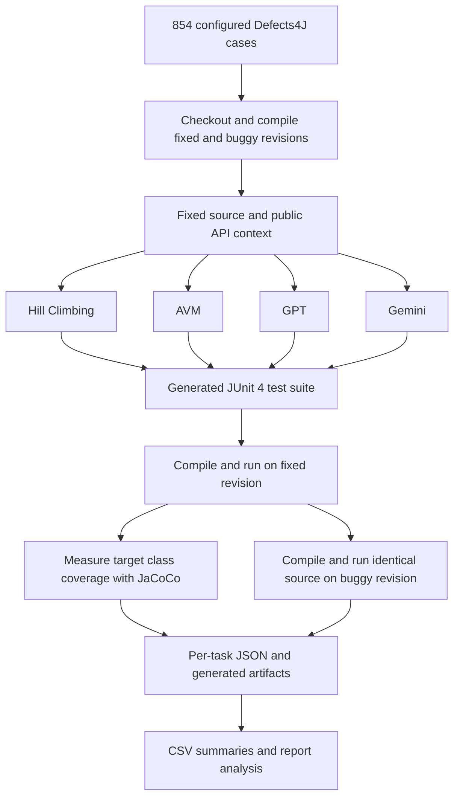

# SQA Defects4J Benchmark

โปรเจกต์นี้เปรียบเทียบการสร้าง Java unit test อัตโนมัติด้วย **Hill Climbing, Alternating Variable Method (AVM), GPT และ Gemini** บนบั๊กจริงจาก Defects4J 854 เคสใน 17 โปรเจกต์ ใช้ JUnit 4 ตรวจเทสต์และ JaCoCo วัด coverage ของ target class

## เอกสารสำหรับอ่านและส่งงาน

| เอกสาร | เนื้อหา |
| --- | --- |
| [FINAL_REPORT.md](FINAL_REPORT.md) | รายงานฉบับสมบูรณ์: วิธีทดลอง ผลเปรียบเทียบ การวิเคราะห์ บทเรียน ปัญหา และข้อจำกัด |
| [Howtouse.md](Howtouse.md) | ติดตั้ง วิเคราะห์ผลเดิม ประเมินเทสต์เดิม และรันการทดลองใหม่ |
| [EXPERIMENT_PROTOCOL.md](EXPERIMENT_PROTOCOL.md) | นิยามตัวชี้วัด ขอบเขตการค้นหา configuration และเงื่อนไขการเปรียบเทียบ |
| [ARTIFACTS.md](ARTIFACTS.md) | รายการ source code, test code, ผลทดสอบ, prompt, configuration และวิธีตรวจชุดส่งงาน |

เอกสารเหล่านี้ตอบโจทย์ทั้งการเปรียบเทียบความสามารถและสรุปการเรียนรู้จากการทดลอง และการส่งหลักฐานที่ทำให้ผู้อ่านตรวจสอบและทำซ้ำได้

## ผลที่มีอยู่ ณ 1 ตุลาคม 2026

มีผล JSON **3,416 งาน** ครบ 854 เคส × 4 วิธี ไม่มี task ซ้ำหรือขาดตาม configuration ปัจจุบัน แต่ยังมี `error` 9 งาน และ HC/AVM มี `unsupported` วิธีละ 503 งาน การมีไฟล์ผลครบจึงไม่ได้หมายความว่าทุกงานสร้างเทสต์สำเร็จ

| วิธี | งาน completed | ชุดเทสต์ valid | valid / completed | บั๊กที่ตรวจพบ / 854 | เวลาต่องานเฉลี่ย (วินาที) |
| --- | ---: | ---: | ---: | ---: | ---: |
| Hill Climbing | 349 | 344 | 98.57% | 12 (1.41%) | 57.77 |
| AVM | 350 | 344 | 98.29% | 11 (1.29%) | 54.08 |
| GPT | 849 | 561 | 66.08% | 38 (4.45%) | 27.66 |
| Gemini | 853 | 428 | 50.18% | 8 (0.94%) | 7.45 |

ตารางเป็นผลรวมเชิงพรรณนา: validity และเวลาใช้เฉพาะงาน `completed` ส่วนอัตราตรวจบั๊กใช้ทั้ง 854 เคส ข้อมูลมี **สอง experiment_id** คือ `9f661b38cc1eee98` และ `1b010d74235e8785` แม้ทุก worker บันทึก Git commit เดียวกัน อ่านผลแยก experiment และการเปรียบเทียบเคสเดียวกันใน [รายงานฉบับสมบูรณ์](FINAL_REPORT.md) ก่อนสรุปความสามารถของแต่ละวิธี

## กระบวนการทดลอง



เทสต์ valid เมื่อ compile และรันผ่านบน fixed revision การตรวจบั๊กต้องใช้ source ของเทสต์เดิม compile ผ่านบน buggy revision แล้วรันไม่ผ่าน โดยผู้สร้างเทสต์ไม่ได้รับ buggy source, patch, diff, issue หรือ triggering test

เมื่อ `target_class` ว่าง ระบบใช้ Defects4J `classes.modified` จึงเป็นการทดลองที่ทราบคลาสเป้าหมายระดับคลาส (target-aware) นอกจากนี้ข้อจำกัดจำนวนเทสต์ของ HC/AVM และ AI ต่างกัน จึงต้องอ่าน coverage ควบคู่กับจำนวนเทสต์และผลบนเคสร่วม

## โครงสร้างไฟล์

```text
run.py                       runner, checkpoint/resume, prompt construction
d4j.py                       Defects4J checkout, compile, API discovery
construction.py              bounded public-API construction planner
evaluate.py                  candidate fitness, JUnit evaluation, JaCoCo
analyze.py                   merge/deduplicate JSON and export standard CSV
algorithms/                  hill_climbing.py, avm.py, candidate_archive.py
ai/                          gpt.py, gemini.py
harness/CandidateRunner.java  Java candidate execution
config/                      cases.csv, settings.json
prompts/                     GPT and Gemini templates
docker/                      Dockerfile, compose.yaml
tests/test_construction.py    tests for benchmark infrastructure
tools/report_analysis.py      additional report analyses and artifact audit
results/workers/              original JSON from all three workers
results/summary/              original aggregate CSV
generated_tests/              generated Java, actual prompts and responses
docs/report_data/             reproduced summaries, subsets, errors, audit
submission/                  packaged submission and checksums
```

`results/` และ `generated_tests/` ถูกละเว้นโดย `.gitignore` จึงต้องส่งชุด artifacts ควบคู่กับ repository ตาม [ARTIFACTS.md](ARTIFACTS.md)

สำหรับ GitHub ให้เก็บ source, เอกสาร, `docs/`, manifest/inventory และ `submission/` ไว้ใน repository โดย `.gitignore` อนุญาต archive final นี้ ไฟล์ผลฉบับเต็มอยู่ใน archive จึงไม่ต้องเพิ่ม raw results และ generated tests หลายพันไฟล์เข้า Git อีกชุด ไฟล์ pilot/backup, checkout เก่า, compiled classes และ cache ถูกนำออกจากโฟลเดอร์โปรเจกต์แล้ว

## วิเคราะห์ผลเดิม

ใช้ Python 3.10 ขึ้นไป คำสั่งเหล่านี้ไม่เรียก API และไม่รัน benchmark ใหม่:

```bash
python3 tools/report_analysis.py
python3 analyze.py --output docs/report_data/aggregate
```

`analyze.py` ฉบับใน workspace นี้เตือนเมื่อรวมหลาย experiment_id แล้วเขียนผลรวม โดยคง ID ใน `all_results.csv` แต่ `summary_by_method.csv` รวมข้าม ID แล้ว ส่วน `tools/report_analysis.py` สร้างผลแยก experiment, เคสร่วม, รายการ error และ audit เพิ่มเติม ดูรายละเอียดการติดตั้งและทำซ้ำใน [Howtouse.md](Howtouse.md)

## การรันใหม่

ทุกเครื่องต้องใช้ source/configuration/prompt เดียวกัน และตรวจ `experiment_id` ให้ตรงกันก่อนรัน แบ่งเคสที่เรียง `(project, bug_id)` เป็นช่วง 1–285, 286–570 และ 571–854 โดยแต่ละเครื่องรันทั้งสี่วิธี ใช้ seed 101 หนึ่งครั้งสำหรับ HC/AVM และ AI วิธีละหนึ่งครั้ง

การแก้เอกสารและเพิ่มเครื่องมือรายงานครั้งนี้ไม่ได้แก้ generator, evaluator, prompt หรือ configuration ของ benchmark ใช้ worker ชื่อใหม่เมื่อต้องการทดลองใหม่เพื่อเก็บผลชุดเดิมไว้ตรวจสอบ
